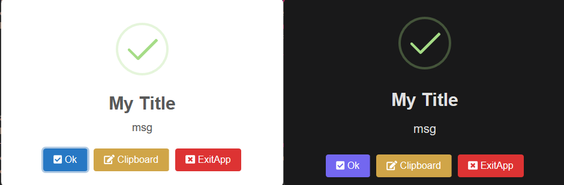
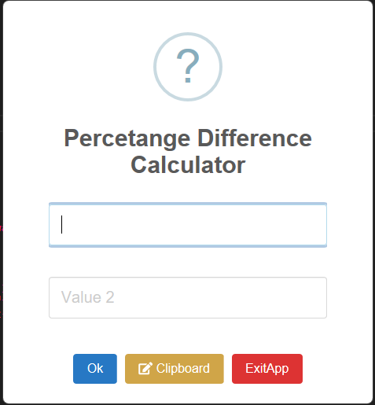

# SweetAlert2-AHK 🍩

SweetAlert2 Ported to AHK powered from G33kdude's Neutron Class

Swal2 "Fire" MsgBox  
  
Swal2 "Toast" Notification  


## Great SweetAlert2 References

- Variables list for Stylessheet https://github.com/sweetalert2/sweetalert2/blob/master/src/variables.scss
- Homepage with bunch of examples https://sweetalert2.github.io/

**SweetAlert2 10.16.7** 🍩

- Swal2 stopped support for legacy JS so for the time being with neutron
  limited to only legacy JS, we are stuck with this version.

**Swal2 Speed Statistics** 🏃‍♂️

- **129.41 ms** Maestrith Msgbox "m()"
- **220.55 ms** without FontAwesome Pro / Free (52.08% increase from m() function)
- **265.75 ms** with FontAwesome Free (18.59% increase from without)
- **586.64 ms** with FontAwesome Pro (90.71% increase from without)
- _the more stylesheets you load (especially from Web not Local) will increase time delay_

## ------------------------Info & Resources---------------------------

the following is just a quick way to always access swal msgbox without the need to have an #Include <swal>. Just make sure the swal.ahk is still within your ahk lib folder.

```ahk
swal := swal()
swal() {
	static newSwal2Instance := new SweetAlert2()
	return newSwal2Instance
}
```

### SweetAlert2 Custom Hotkeys if using DefaultActions / CustomClass 🎮

- "**Esc**" will close Swal2 Msgbox and return to the next line in AHK script.
- "**Enter**" will confirm on the focused button
- "**Ctrl+C**" will click Clipboard button (or denied button)
- "**Ctrl+X**" will ExitApp

## Swal2 Library Dependencies

### G33kdude's Neutron 🌍

Updated Neutron to allow communication to Swal2 in the \_\_New method & Load method within neutron's class I added the same line to each to allow sending a new instance command to the swal2 class `"this.wnd.swal := new SweetAlert2()"`

### Geekdude's cJson

- You could replace cJson with your own choosing of a JSON parser

### Simple Use of Swal2 Class

```ahk
Swal.fire("msg",{title:"My Title",icon:"success"})
Swal.toast("msg")
```

### Fire & Toast Method Parameters

```ahk
Swal.fire("string",{options}[,wait := "1",defaultActions := "1", customClass := "0"])
Swal.toast("string",{options}[,wait := "0",sleep := "0"])
```

## Default & Dark Mode, THEMES! 🌕🌚



- Set in the options object, {theme:dark} you can enable a bunch of themes
- by default, light/dark mode will trigger based on the time of day. I set it to turn to dark from 7pm - 7am
- The available themes are (and you could create your own)
  - bootstrap-4
  - borderless
  - bulma
  - dark
  - default
  - material-ui
  - minimal
  - wordpress-admin

## Swal2 Examples Converted to AHK

- Examples taken top to bottom from https://sweetalert2.github.io/
- As of 11/3/2021 not all below examples are working

```ahk
; A basic message
JS =
(LTrim Join`n
    Swal.fire('Any fool can use a computer')
)
Swal.fire(JS)
```

```ahk
; A title with a text under
JS =
(LTrim Join`n
    Swal.fire(
        'The Internet?',
        'That thing is still around?',
        'question'
    `)
)
Swal.fire(JS)
```

```ahk
; A modal with a title, an error icon, a text, and a footer
JS =
(LTrim Join`n
    Swal.fire({
        icon: 'error',
        title: 'Oops...',
        text: 'Something went wrong!',
        footer: '<a href="">Why do I have this issue?</a>'
    })
)
Swal.fire(JS)
```

```ahk
; A modal window with a long content inside:
JS =
(LTrim Join`n
    Swal.fire({
        imageUrl: 'https://placeholder.pics/svg/300x900',
        imageHeight: 900,
        imageAlt: 'A tall image'
    })
)
Swal.fire(JS)
```

```ahk
; Custom HTML description and buttons with ARIA labels (having some trouble with dimensions on this one)
JS =
(LTrim Join`n
    Swal.fire({
        title: '<strong>HTML <u>example</u></strong>',
        icon: 'info',
        html:
            'You can use <b>bold text</b>, ' +
            '<a href="//sweetalert2.github.io">links</a> ' +
            'and other HTML tags',
        showCloseButton: true,
        showCancelButton: true,
        focusConfirm: false,
        confirmButtonText:
            '<i class="fa fa-thumbs-up"></i> Great!',
        confirmButtonAriaLabel: 'Thumbs up, great!',
        cancelButtonText:
            '<i class="fa fa-thumbs-down"></i>',
        cancelButtonAriaLabel: 'Thumbs down'
    })
)
Swal.fire(JS)
```

```ahk
; A dialog with three buttons ( need to fix 2nd popup msg recalculating wnd size)
JS =
(LTrim Join`n
    Swal.fire({
        title: 'Do you want to save the changes?',
        showDenyButton: true,
        showCancelButton: true,
        confirmButtonText: 'Save',
        denyButtonText: "Don't save",
    }).then(function (result) {
        if (result.isConfirmed) {
            Swal.fire('Saved!', '', 'success')
        } else if (result.isDenied) {
            Swal.fire('Changes are not saved', '', 'info')
        }
    })
)
Swal.fire(JS)
```

```ahk
; A custom positioned dialog ( need to add positioning to fire)
JS =
(LTrim Join`n
    Swal.fire({
        position: 'top-end',
        icon: 'success',
        title: 'Your work has been saved',
        showConfirmButton: false,
        timer: 1500
    })
)
Swal.fire(JS)
```

```ahk
; Custom animation with Animate.css -- https://animate.style/
; the difference is it will animate from the position of the msg popup
; since the neutron wnd is not full screen
JS =
(LTrim Join`n
    Swal.fire({
        title: 'Custom animation with Animate.css',
        showClass: {
            popup: 'animate__animated animate__fadeInDown'
        },
        hideClass: {
            popup: 'animate__animated animate__fadeOutUp'
        }
    })
)
Swal.fire(JS)
```

```ahk
; A confirm dialog, with a function attached to the "Confirm"-button...
JS =
(LTrim Join`n
    Swal.fire({
        title: 'Are you sure?',
        text: "You won't be able to revert this!",
        icon: 'warning',
        showCancelButton: true,
        confirmButtonColor: '#3085d6',
        cancelButtonColor: '#d33',
        confirmButtonText: 'Yes, delete it!'
    }).then(function (result) {
        if (result.isConfirmed) {
            Swal.fire('Deleted!','Your file has been deleted.','success')
        }
    })
)
Swal.fire(JS)
```

```ahk
; ... and by passing a parameter, you can execute something else for "Cancel".
JS1 =
(LTrim Join`n
    const swalWithBootstrapButtons = Swal.mixin({
        customClass: {
            confirmButton: 'btn btn-success',
            cancelButton: 'btn btn-danger'
        },
        buttonsStyling: false
    })
)
JS2 =
(LTrim Join`n
    swalWithBootstrapButtons.fire({
        title: 'Are you sure?',
        text: "You won't be able to revert this!",
        icon: 'warning',
        showCancelButton: true,
        confirmButtonText: 'Yes, delete it!',
        cancelButtonText: 'No, cancel!',
        reverseButtons: true
    }).then(function (result) {
        if (result.isConfirmed) {
            swalWithBootstrapButtons.fire('Deleted!','Your file has been deleted.','success')
        } else if (result.dismiss === Swal.DismissReason.cancel) {
            swalWithBootstrapButtons.fire('Cancelled','Your imaginary file is safe :)','error')
        }
    })
)
Swal.fire(JS1 JS2)
```

```ahk
; A message with a custom image
JS =
(LTrim Join`n
    Swal.fire({
        title: 'Sweet!',
        text: 'Modal with a custom image.',
        imageUrl: 'https://unsplash.it/400/200',
        imageWidth: 400,
        imageHeight: 200,
        imageAlt: 'Custom image',
    })
)
Swal.fire(JS)
```

```ahk
; A message with custom width, padding, background and animated Nyan Cat
JS =
(LTrim Join`n
    Swal.fire({
        title: 'Custom width, padding, background.',
        width: 600,
        padding: '3em',
        background: '#fff url(/images/trees.png)',
        backdrop: 'rgba(0,0,123,0.4) url("/images/nyan-cat.gif") left top no-repeat'
    })
)
Swal.fire(JS)
```

```ahk
; A message with auto close timer
JS =
(LTrim Join`n
    let timerInterval
    Swal.fire({
        title: 'Auto close alert!',
        html: 'I will close in <b></b> milliseconds.',
        timer: 2000,
        timerProgressBar: true,
        didOpen: function () {
            Swal.showLoading()
            const b = Swal.getHtmlContainer().querySelector('b')
            timerInterval = setInterval(function () {
                b.textContent = Swal.getTimerLeft()
            }, 100)
        },
        willClose: function () {
            clearInterval(timerInterval)
        }
    }).then(function (result) {
        if (result.dismiss === Swal.DismissReason.timer) {
            console.log('I was closed by the timer')
        }
    })
)
Swal.fire(JS)
```

```ahk
; Right-to-left support for Arabic, Persian, Hebrew, and other RTL languages
JS =
(LTrim Join`n
    Swal.fire({
        title: 'هل تريد الاستمرار؟',
        icon: 'question',
        iconHtml: '؟',
        confirmButtonText: 'نعم',
        cancelButtonText: 'لا',
        showCancelButton: true,
        showCloseButton: true
    })
)
Swal.fire(JS)
```

```ahk
; AJAX request example (having trouble with neutron Fetch API / Promise Returns)
JS =
(LTrim Join`n
    Swal.fire({
        title: "Submit your Github username",
        input: "text",
        inputAttributes: {
            autocapitalize: "off",
        },
        showCancelButton: true,
        confirmButtonText: "Look up",
        showLoaderOnConfirm: true,
        preConfirm: function preConfirm(login) {
            return fetch("//api.github.com/users/" + login)
                .then(function (response) {
                    if (!response.ok) {
                        throw new Error(response.statusText)
                    }
                    return response.json()
                })
                .catch(function (error) {
                    Swal.showValidationMessage("Request failed: " + error)
                })
        },
        allowOutsideClick: function allowOutsideClick() {
            return !Swal.isLoading()
        },
    }).then(function (result) {
        if (result.isConfirmed) {
            Swal.fire({
                title: result.value.login + "'s avatar",
                imageUrl: result.value.avatar_url,
            })
        }
    })
)
Swal.fire(JS)
```

## Some custom made examples

- Ctrl X will close the window
- Ctrl C will click clipboard
- Enter will hit submit



```ahk
; Created a Percentage Diff Calculator
JS =
(LTrim Join`n
    Swal.fire({
        className: "swal-css",
                showClass: {
                    backdrop: "rgba(0,0,0,0.0);swal2-noanimation",
                    popup: "",
                },
        title: 'Percetange Difference Calculator',
        html: '<input id="swal-input1" class="swal2-input" placeholder="Value 1">' +
            '<input id="swal-input2" class="swal2-input" placeholder="Value 2">',
        icon: "question",
        showDenyButton: true,
        showCancelButton: true,
        confirmButtonText: "Ok",
        cancelButtonText: "ExitApp",
        cancelButtonColor: '#d33',
        denyButtonText: '<i class="fa fa-edit"></i> Clipboard',
        denyButtonColor: "#D0A548",
        focusConfirm: false,
        allowEscapeKey: false,
        preConfirm: function () {
            const val1 = Swal.getPopup().querySelector('#swal-input1').value
            const val2 = Swal.getPopup().querySelector('#swal-input2').value
            if (!val1 || !val2) {
                Swal.resetValidationMessage()
                Swal.showValidationMessage("Please enter values 1 & 2")
            }
            return { val1: val1, val2: val2 }
        },
        preDeny: function () {
            const val1 = Swal.getPopup().querySelector('#swal-input1').value
            const val2 = Swal.getPopup().querySelector('#swal-input2').value
            if (!val1 || !val2) {
                Swal.resetValidationMessage()
                Swal.showValidationMessage("Please enter values 1 & 2 PLEASE!!!")
            }
            return ((val1 && val2) ? true : false)
        }
    }).then(function (result) {
        let v1 = Number($("#swal-input1").val())
        let v2 = Number($("#swal-input2").val())
        let vDiff = ((v1-v2)/((v1+v2)/2))*100
        if (result.isConfirmed) {
            Swal.update({

            })
            ; ahk.exitSwal()
        }
        if (result.isDenied) {
            ahk.setClipboard(vDiff)
            ahk.exitSwal()
        }
        if (result.isDismissed) {
            ahk.exitApp()
        }
    })
    $("#swal-input1").show()
)
Swal.fire(JS)
```

```ahk
; you can create a new icon using the "iconHtml"
; notice how using "titleText" forces it to be pure text so NO html will be converted
; make use of the shortcut for fontawesome icons "this.getFaIcon("icon here")"
vRnd := swal.getRandomFaIcon()
JS =
(LTrim Join`n
    Swal.fire({
        titleText: '<i>Sweet!</i>',
        iconHtml: this.getFaIcon("%vRnd%"),
        iconColor: "magenta",
        text: 'text is here',
        imageUrl: 'https://unsplash.it/400/200',
        imageWidth: 400,
        imageHeight: 200,
        imageAlt: 'Custom image',
        showCancelButton: true,
        reverseButtons: true,
        buttonsStyling: true,
        showCloseButton: true,
    })
)
Swal.fire(JS)
```

```ahk
; Can inject scripts/stylesheets, ex: "Add reCAPTCHA"
JS =
(
    $('head').append('<script src="https://www.google.com/recaptcha/api.js"><\/script>');
    Swal.fire({
        title: 'SweetAlert2 Recaptcha',
        html: '<div id="recaptcha"></div>',
        didOpen: function () {
            grecaptcha.render('recaptcha', {
            'sitekey': '6LdvplUUAAAAAK_Y5M_wR7s-UWuiSEdVrv8K-tCq'
            })
        },
        preConfirm: function () {
            if (grecaptcha.getResponse().length === 0) {
                Swal.showValidationMessage("Please verify that you're not a robot")
            }
        }
    })
)
Swal.fire(JS)
```

```ahk
; Create function on when Swal message successfully Opens
JS =
(LTrim Join`n
    Swal.fire({
        title: 'Function on Open',
        html: 'look to the bottom-right for a toast msg',
        didOpen: function () {
            swal.toast("msg on success of open")
        },
    })
)
Swal.fire(JS)
```

```ahk
; Bunch of Toast examples
swal.Toast("<i>Lorem ipsum dolor sit amet consectetur adipisicing elit. Quia ut labore impedit quaerat, sint iure officia consectetur esse amet nisi deserunt optio cum quis totam vero perspiciatis adipisci iste ex, autem voluptatum pariatur quae, minima eligendi culpa. Ratione cumque repellendus ducimus, unde quasi, nulla maiores inventore, nisi odio doloremque porro.</i>",{timer:99000,icon:"error",colored:false,theme:"",color:"red",title:swal.getFaIcon("tree") "Feliz Navidad",titleColor: "green"},0)
swal.Toast("PART TWO toasty",{timer:99000,icon:"question",colored:false,theme:"default"},0)
swal.Toast("<p style='color:orange'>PART three toasty</p>",{timer:99000,icon:"warning",colored:false,theme:"borderless"},0)
swal.Toast("Lorem ipsum, dolor sit amet consectetur adipisicing elit. Fugiat non voluptatum quisquam temporibus adipisci quo? Aliquid voluptatem deleniti nobis praesentium soluta inventore dignissimos cum alias, excepturi, ad sit laboriosam possimus quae ipsam suscipit labore repellat voluptates fugit magnam eveniet nam. Tempora, vitae minus. Repudiandae dolores magni, dolorum officia dolorem vitae reprehenderit repellat exercitationem eos modi nesciunt odio corporis minima laboriosam aperiam voluptatum expedita molestiae excepturi quis error illo incidunt alias consequatur. Assumenda fugit officiis nemo? Tempora, iste doloremque ex earum voluptatum eaque unde. Expedita ipsam nemo porro minus nobis voluptatem magni. Magnam illum dicta similique nobis harum qui fugit quisquam.",{timer:99000,icon:"error",colored:true,timer:99000},0,1500,1)
swal.Toast("PART five toasty",{timer:99000,icon:"info",colored:true},0)
swal.Toast("PART six toasty",{timer:99000,icon:"success",colored:true},0)
```
